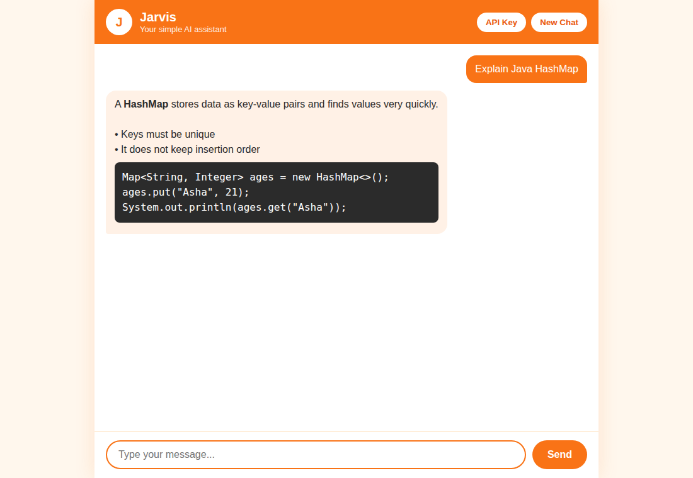
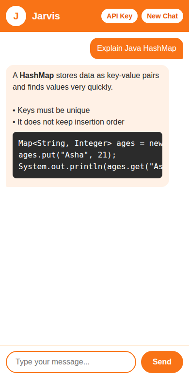

# Jarvis: Simple AI Chatbot

A simple, beginner-friendly AI chatbot built with **HTML, CSS and plain JavaScript**, using the **Google Gemini API**. The design is orange and white.

| Desktop | Mobile |
|---|---|
|  |  |

## Features

- Chat with Gemini and keep the conversation going
- "Typing..." dots while Jarvis thinks
- Chat is saved in the browser (LocalStorage), so it is still there after a refresh
- New Chat button
- Code blocks and **bold** text shown nicely
- Friendly error messages (no key, wrong key, no internet, Gemini busy)
- Tries backup Gemini models if one is busy
- Works on desktop and mobile

## Tech stack

HTML5, CSS3, vanilla JavaScript, Google Gemini API (`fetch` with `async/await`), browser LocalStorage. No frameworks, no backend, no database.

## Project structure

```
jarvis-simple-chatbot/
├── index.html    The page (header, messages, message box)
├── style.css     Orange and white design
├── script.js     All the JavaScript logic
└── README.md
```

## Setup

1. Get a free API key at https://aistudio.google.com/apikey
2. Open the folder in VS Code and run `index.html` with the **Live Server** extension (right-click, "Open with Live Server").
3. Click **API Key** in the app, paste your key and click **Save**.
4. Type a message and press Enter.

Your key is stored only in your own browser. It is not written in the code.

## How it works

1. You send a message. It is added to the `chat` list and shown on screen.
2. `askGemini()` sends the whole conversation to Gemini with `fetch`.
3. Gemini's answer is read from `data.candidates[0].content.parts`.
4. The answer is shown, and the chat is saved in LocalStorage.

## Future improvements

- Copy button on replies
- Dark mode
- Several saved conversations
- Streaming replies
